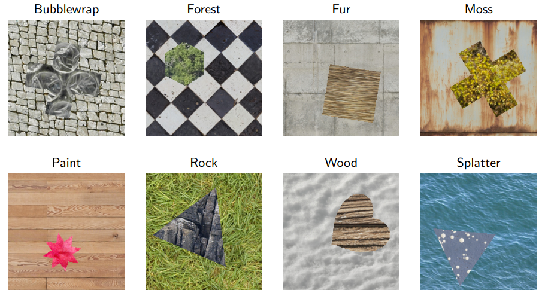

# Synthetic image segmentation dataset

This repository provides a framework to generate simple image segmentation datasets to be used in the evaluation of machine learning models. The generator produces synthetic images along with segmentation masks and annotation XML files. The images consist of a background texture and one or multiple geometric shapes filled with a texture. 

